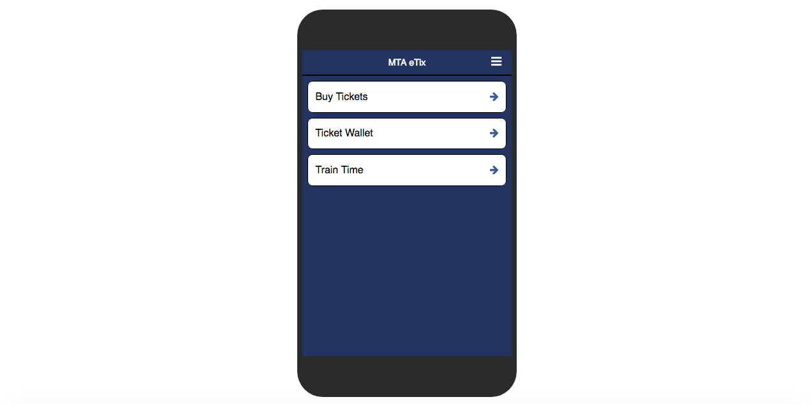
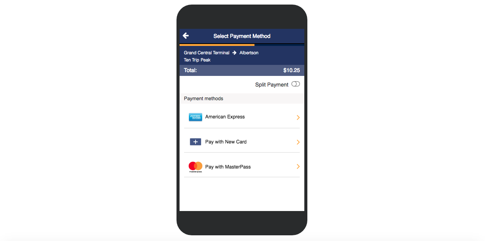
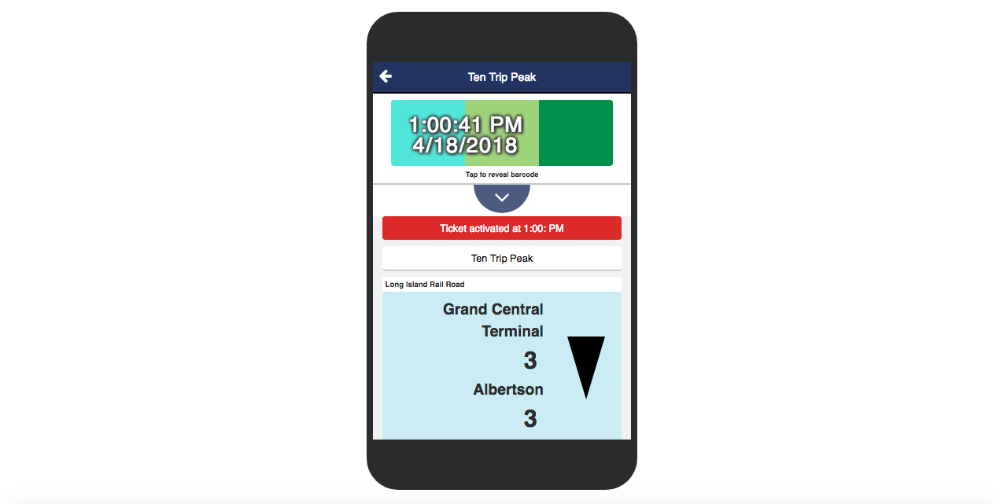

# COLORFUL BLOCK

A simple front-end app built with React that's inspired by the MTA LIRR train ticketing app. Users can select an origin and destination. Activating the ticket will display the current time and date that's constantly moving left to right over a three colored boxes that's generated with random colors.

### DATE/TIME
- setInterval to render the time component in every second.
- new Date() to show the date, day and time.
- keyframes for the component to constantly move horizontally.

### COLORFUL BLOCKS
- setInterval to render the time component in every second.
- new Date() to show the date, day and time.
- Math.random() to generate random RGB colors
- keyframes for the component to transition between different levels of opacity.
